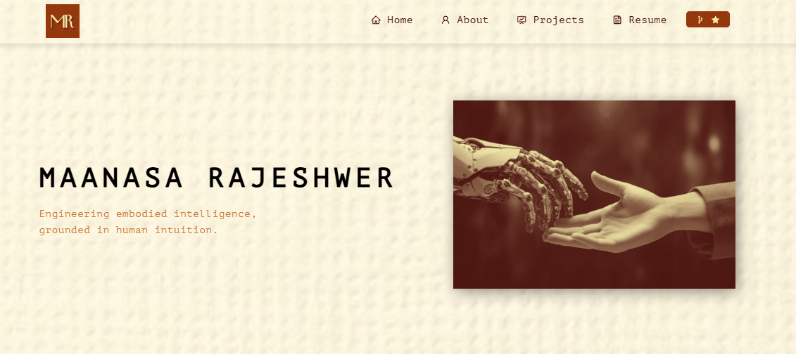

<h2 align="center">
  Portfolio Website - v2.0 
  <a href="=https://maanarajesh-github-io.vercel.app/" target="_blank">maanarajesh.tech</a>
</h2>

  

 

 &nbsp;
 &nbsp;
 &nbsp;

<h2 align="center">
  Maanasa Rajeshwer — Portfolio 
  <a href="YOUR_VERCEL_URL" target="_blank">Live Site</a>
</h2>

## About
Personal website showcasing robotics projects in embodied AI, multimodal perception, and human-centered interaction (haptics/wearables), including demos and technical write-ups.

## Built With
- React
- React-Bootstrap
- Vercel

## Local Development
npm install
npm start

## Credit
This site started from a fork of Soumyajit Behera’s portfolio template and has been customized for my content and projects.
